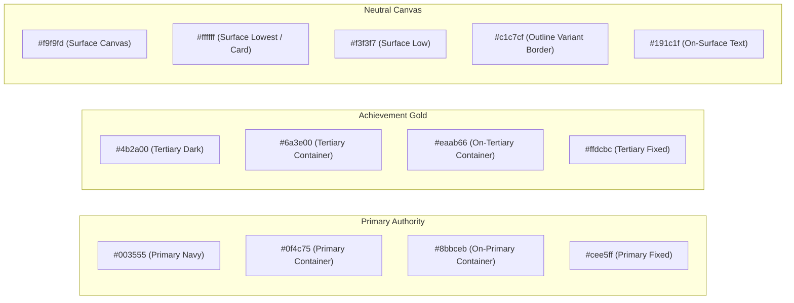

# InsideJibon — Academic Modernism Master Design System

This is the definitive design system specification for **InsideJibon**, the digital education platform for **Tanvir Hasan Jibon**. All components, pages, and stylesheets across the codebase must adhere strictly to the rules documented here.

---

## 1. Brand Identity & Product Context

* **Platform Name**: InsideJibon (ইনসাইডজীবন)
* **Lead Educator**: Tanvir Hasan Jibon (Department of Botany, Dhaka Central University / Govt. Titumir College)
* **Core Curricula**: Physics (পদার্থবিজ্ঞান), Chemistry (রসায়ন), Biology (জীববিজ্ঞান), Mathematics (গণিত) for SSC, HSC & University Admission test prep (DU, JU, RU, GST, Medical & Engineering).
* **Tone & Voice**: Rigorous, Academic, Encouraging, Calm, Modern, Structured.

---

## 2. Color Palette & Design Tokens

The palette balances authoritative deep navy with warm celebratory amber accents and cool structural neutrals.



### Authoritative Token Table

| CSS Variable | Hex | Role / Usage | Tailwind Utility |
|---|---|---|---|
| `--color-primary` | `#003555` | Brand anchor, major buttons, primary headings, active tabs | `bg-primary`, `text-primary` |
| `--color-primary-container` | `#0f4c75` | Container backgrounds, highlighted active states | `bg-primary-container` |
| `--color-on-primary` | `#ffffff` | Text on primary navy backgrounds | `text-on-primary` |
| `--color-on-primary-container` | `#8bbceb` | Light blue text on primary container backgrounds | `text-on-primary-container` |
| `--color-primary-fixed` | `#cee5ff` | Subtle blue badge tint, selected MCQ option fill | `bg-primary-fixed` |
| `--color-primary-fixed-dim` | `#9acbfb` | Active border highlight for exam questions | `border-primary-fixed-dim` |
| `--color-secondary` | `#4f6072` | Secondary slate text, sub-labels, metadata, timestamps | `text-secondary` |
| `--color-secondary-container` | `#d2e4fa` | Secondary pill badge background | `bg-secondary-container` |
| `--color-on-secondary-container`| `#556678` | Text on secondary container badge | `text-on-secondary-container` |
| `--color-tertiary` | `#4b2a00` | Deep amber / bronze for achievements | `text-tertiary` |
| `--color-tertiary-container` | `#6a3e00` | Educator badge background, milestone container | `bg-tertiary-container` |
| `--color-on-tertiary-container`| `#eaab66` | Warm gold text on tertiary container | `text-on-tertiary-container` |
| `--color-tertiary-fixed` | `#ffdcbc` | Light warm amber chip background | `bg-tertiary-fixed` |
| `--color-surface` | `#f9f9fd` | Page canvas background (light, clean off-white) | `bg-surface` |
| `--color-surface-container-lowest`| `#ffffff` | Card backgrounds, dialogs, inputs, white cards | `bg-surface-container-lowest` |
| `--color-surface-container-low` | `#f3f3f7` | Table header background, subtle section tint | `bg-surface-container-low` |
| `--color-surface-container` | `#edeef1` | Neutral chip fill, divider background | `bg-surface-container` |
| `--color-surface-container-high`| `#e7e8ec` | Inactive progress track, video placeholder | `bg-surface-container-high` |
| `--color-surface-container-highest`|`#e2e2e6`| Progress bar track fill | `bg-surface-container-highest` |
| `--color-on-surface` | `#191c1f` | Primary high-contrast body text (900-weight equivalent) | `text-on-surface` |
| `--color-on-surface-variant` | `#41474e` | Secondary body text, description paragraphs | `text-on-surface-variant` |
| `--color-outline` | `#72787f` | Strong borders, inactive icons | `border-outline`, `text-outline` |
| `--color-outline-variant` | `#c1c7cf` | Standard card border, dividing rule (1px crisp) | `border-outline-variant` |
| `--color-error` | `#ba1a1a` | Form error text, failed exam status, delete actions | `text-error`, `bg-error` |
| `--color-error-container` | `#ffdad6` | Error notification / warning card fill | `bg-error-container` |
| `--color-on-error-container` | `#93000a` | Deep red text on error container | `text-on-error-container` |

---

## 3. Typography Hierarchy & Dual-Font Pairing

InsideJibon uses a **dual-font pairing**:
* **Plus Jakarta Sans** for Display and Headings (H1–H6).
* **Inter** for Body text, UI labels, buttons, forms, and data tables.
* **Hind Siliguri / Noto Sans Bengali** for Bengali glyphs.

```
Display Large:       48px / 60px / -0.02em tracking / Bold (700)      [Plus Jakarta Sans]
Display Mobile:      32px / 40px / -0.02em tracking / Bold (700)      [Plus Jakarta Sans]
Headline Large:      30px / 38px / Semibold (600)                      [Plus Jakarta Sans]
Headline Medium:     24px / 32px / Semibold (600)                      [Plus Jakarta Sans]
Headline Small:      20px / 28px / Semibold (600)                      [Plus Jakarta Sans]
Body Large:          18px / 28px / Regular (400)                       [Inter]
Body Medium:         16px / 24px / Regular (400)                       [Inter]
Body Small:          14px / 20px / Regular (400)                       [Inter]
Label Medium:        14px / 20px / 0.01em tracking / Semibold (600)   [Inter]
Label Small:         12px / 16px / Medium (500)                        [Inter]
Caption / Micro:     10px / 14px / Bold (700) Uppercase                [Inter]
```

### Rules
1. Never mix fonts within the same word or sentence.
2. Bengali text rendered alongside English automatically inherits appropriate line-height (`leading-relaxed` or `leading-loose`) to prevent diacritic clipping.
3. Card titles use `font-display text-lg font-bold tracking-tight text-on-surface`.

---

## 4. Layout, Bento Grid & Spacing

### Base Grid System
* **Desktop**: 12-column grid (`grid grid-cols-12 gap-6`) with `max-w-6xl` (`1152px`) or `max-w-7xl` (`1280px`) centered container.
* **Tablet (sm/md)**: 2-column or 6-column grid (`grid-cols-1 sm:grid-cols-2 lg:grid-cols-12`).
* **Mobile**: Single-column vertical flow with `px-4 py-6` padding.

### Spacing Scale (8px Multiples)
* `xs`: 4px (`gap-1`, `p-1`)
* `sm`: 8px (`gap-2`, `p-2`)
* `md`: 16px (`gap-4`, `p-4`)
* `lg`: 24px (`gap-6`, `p-6`) — **Default Grid Gutter**
* `xl`: 32px (`gap-8`, `p-8`)
* `xxl`: 48px (`gap-12`, `p-12`) — **Section Spacing**

---

## 5. Tactile Elevation & Card Geometry

InsideJibon deliberately rejects heavy drop shadows, neon glows, and glassmorphism. It uses **tactile, crisp elevation**:

```css
/* Canonical Academic Bento Card */
.bento-card {
  background: #ffffff;
  border: 1px solid #c1c7cf;
  border-radius: 0.75rem; /* 12px rounded-xl */
  transition: box-shadow 0.2s ease-in-out, transform 0.2s ease-in-out;
}

.bento-card:hover {
  box-shadow: 0px 4px 12px rgba(15, 76, 117, 0.07);
  transform: translateY(-1px);
}

.bento-card-static {
  background: #ffffff;
  border: 1px solid #c1c7cf;
  border-radius: 0.75rem;
}
```

### Corner Radius System
* **Tags, status chips, pill buttons**: `rounded-full` (`9999px`)
* **Small inputs, action buttons, select triggers**: `rounded-lg` (`8px`)
* **Standard bento cards, modals, hero containers**: `rounded-xl` (`12px`) or `rounded-2xl` (`16px`)

---

## 6. Accessibility & Contrast Standards

1. **Contrast Compliance**: Every text element meets or exceeds **WCAG 2.1 AA** (4.5:1 for normal text, 3:1 for large text). Deep navy `#003555` on `#ffffff` achieves **13.8:1**.
2. **Keyboard Focus Rings**: All interactive controls must support visible focus states:
   ```css
   *:focus-visible {
     outline: 2px solid #003555;
     outline-offset: 2px;
   }
   ```
3. **Live Regions**: Dynamic exam countdown timers and notification counts must use `aria-live="polite"` and `role="timer"`.
4. **Dialogs**: All modal overlays must declare `role="dialog"` and `aria-modal="true"`.