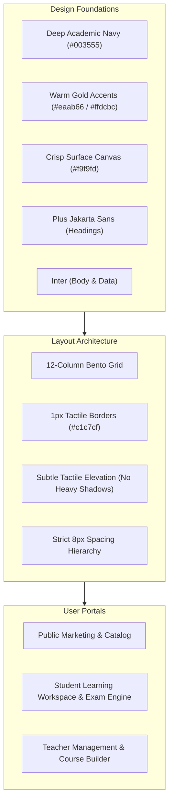

# InsideJibon Design System & Prototype Hub (`.stitch`)

Welcome to the **InsideJibon Design System & Prototype Hub**. This directory contains the complete architectural specifications, high-fidelity prototypes, component blueprints, and visual assets that define the user experience for **InsideJibon** — the official digital learning platform for educator **Tanvir Hasan Jibon**.

---

## 🧭 Navigation & Directory Map

| Document | Purpose |
|---|---|
| [**`DESIGN.md`**](./DESIGN.md) | **The Master Design System Specification**: Color tokens, typography hierarchy, elevation, bento grid layout, and component rules. |
| [**`INDEX.md`**](./INDEX.md) | **Screen & Prototype Catalog**: Complete mapping of every prototype mockup to its corresponding Next.js App Router route. |
| [**`COMPONENTS.md`**](./COMPONENTS.md) | **Component Blueprint Library**: Copy-pasteable HTML & Tailwind v4 reference implementations for 15+ core UI patterns. |
| [**`ASSETS.md`**](./ASSETS.md) | **Asset Registry & Guide**: Image assets, photography, badges, and export instructions. |

---

## 🎨 Core Design Philosophy: Academic Modernism

InsideJibon is built upon the **Academic Modernism** design language. It harmonizes the scholarly gravitas of traditional academic institutions with the sleek, tactile responsiveness of modern edtech SaaS platforms.

### Key Tenets
1. **Academic Rigor & Trust**: Deep navy (`#003555`) anchors authority, while warm amber/gold (`#eaab66`) highlights student milestones and achievements.
2. **Generous Whitespace & Bento Structure**: Modular 12-column bento grids keep information organized and prevent cognitive overload.
3. **Tactile Restraint**: Zero garish gradients, neon colors, or exaggerated drop shadows; crisp 1px borders (`#c1c7cf`) and subtle hover lifts (`0px 4px 12px rgba(15, 76, 117, 0.05)`) provide tactile feedback.
4. **Bilingual Symmetry (Bangla & English)**: Native typography support for English and Bengali (Hind Siliguri / Noto Sans Bengali fallback) across 1,430+ strings.

---

## 📱 Prototype to Codebase Mapping

| Screen / Prototype | Prototype Directory | Live Application Route | Main Component |
|---|---|---|---|
| **Public Homepage** | [`designs/public_homepage`](./designs/public_homepage/) | `src/app/(marketing)/page.tsx` | [`MarketingHeader`](../src/components/public/marketing-header.tsx) + [`(marketing)/page.tsx`](../src/app/(marketing)/page.tsx) |
| **Course Catalog** | [`designs/public_homepage_clean_assets`](./designs/public_homepage_clean_assets/) | `src/app/(marketing)/courses/page.tsx` | [`PublicCourseCard`](../src/components/public/course-card.tsx) |
| **Course Landing Page** | [`designs/course_learning_page`](./designs/course_learning_page/) | `src/app/(marketing)/courses/[slug]/page.tsx` | [`[slug]/page.tsx`](../src/app/(marketing)/courses/[slug]/page.tsx) |
| **Student Dashboard** | [`designs/student_dashboard_desktop`](./designs/student_dashboard_desktop/) | `src/app/student/page.tsx` | [`StudentCourseCard`](../src/components/student/student-course-card.tsx) + Bento Hub |
| **Learning Workspace** | [`designs/course_learning_page_desktop`](./designs/course_learning_page_desktop/) | `src/app/student/courses/[courseId]/learn/page.tsx` | [`LearningSidebar`](../src/components/student/learning-sidebar.tsx) + [`LearnPageTabs`](../src/components/student/learn-tabs.tsx) |
| **Online Examination** | [`designs/online_examination_interface_desktop`](./designs/online_examination_interface_desktop/) | `src/app/student/courses/[courseId]/exams/[examId]/page.tsx` | [`ExamTaker`](../src/components/student/exams/exam-taker.tsx) |
| **Exam Result & Review** | [`designs/student_exam_result_desktop`](./designs/student_exam_result_desktop/) | `src/app/student/courses/[courseId]/exams/[examId]/result/page.tsx` | [`ExamResultView`](../src/components/student/exams/exam-result-view.tsx) |
| **Teacher Dashboard** | [`designs/teacher_dashboard_desktop`](./designs/teacher_dashboard_desktop/) | `src/app/teacher/page.tsx` | [`TeacherNav`](../src/components/teacher/teacher-nav.tsx) + Metric Cards |
| **Curriculum Builder** | [`designs/course_builder_desktop`](./designs/course_builder_desktop/) | `src/app/teacher/courses/[courseId]/builder/page.tsx` | [`CurriculumBuilder`](../src/components/teacher/builder/curriculum-builder.tsx) |

---

## 🛠️ How to Use This Directory

* **When building new UI**: Reference [`COMPONENTS.md`](./COMPONENTS.md) for canonical HTML/Tailwind snippets to ensure visual parity with existing pages.
* **When modifying design tokens**: Check [`DESIGN.md`](./DESIGN.md) for the authoritative color palette and type scale before editing `src/app/globals.css`.
* **When inspecting mockups**: Open any `code.html` file in `designs/*` in a browser or IDE preview to inspect interactive HTML/Tailwind implementations.
